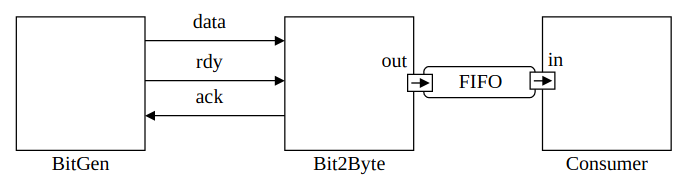
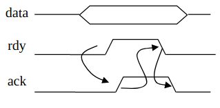
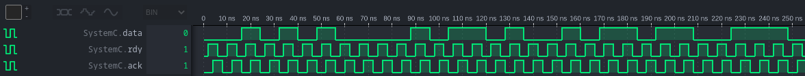
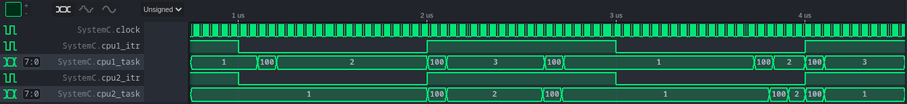

# Temps Réel - Compte rendu de TP


Dylan Robins, Quentin Werlé - E2I5 2022

## 1. Table des matières

- [1. Table des matières](#1-table-des-matières)
- [2. TP1A: producteur/consommateur](#2-tp1a-producteurconsommateur)
- [3. TP1B: Modélisation d'un système simple](#3-tp1b-modélisation-dun-système-simple)
- [4. TP2: Modélisation et implémentation d'un système multi-tâches et multi-processeur](#4-tp2-modélisation-et-implémentation-dun-système-multi-tâches-et-multi-processeur)
  - [4.1. Compréhension du code fourni](#41-compréhension-du-code-fourni)
  - [4.2. Ajout des tâches 4 et 5](#42-ajout-des-tâches-4-et-5)
  - [4.3. Interuptions](#43-interuptions)
- [5. TP3: La communication intra-processeur dans un système multi-tâches et multi-processeurs](#5-tp3-la-communication-intra-processeur-dans-un-système-multi-tâches-et-multi-processeurs)

## 2. TP1A: producteur/consommateur

Dans cette première partie, nous allons étudier un exemple simple de producteur/consommateur implémenté en SystemC afin de nous familiariser avec cette bibliothèque. On commence par compiler et lancer le programme fourni:

```
$ make
g++ -std=c++17 -O3 -Wall -I. -I.. -I/opt/systemc/include -c simple_fifo.cpp
g++ -std=c++17 -O3 -Wall -I. -I.. -I/opt/systemc/include -L. -L.. -L/opt/systemc/lib -o run.x simple_fifo.o -lsystemc -lm  2>&1 | c++filt

$ ./run.x

        SystemC 2.3.4_pub_rev_20191203-Accellera --- Mar 14 2022 14:37:05
        Copyright (c) 1996-2019 by all Contributors,
        ALL RIGHTS RESERVED


V<9>isit www.<0>s<9>ystemc.or<0>g<9> and see <0>w<9>hat Syste<0>m<9>C can do <0>f<9>or you to<0>day!
<0>%
```

On constate que le programme affiche une chaîne de caractères en indiquant à intervalles régulier un nombre (0 ou 9).

On étudie maintenant le contenu du fichier cpp fourni afin de comprendre les différents objets utilisés. Commençons par étudier le point d'entrée du programme, la fonction `main`:

```c++
int sc_main (int argc , char *argv[]) {
  top top1("Top1");
  sc_start();
  return 0;
}
```

On constate qu'on instancie un objet de classe `top`, puis nous démarrons la simulation. L'objet `top` hérite de la classe `sc_module`, qui est décrite comme la *"Base class for all structural entities"*, c'est à dire qu'elle modélise le comportement de base d'une entité structurelle comme nous avons manipulé en VHDL.

Le constructeur de l'objet `top` instantie et connecte ensemble trois objets: une instance de `fifo`, une instance de `producer` et une instance de `consumer`. Les classes `producer` et `consumer` sont elles aussi des modules SystemC, mais contrairement à `top` elles comportent des variables publiques de type `sc_port`, qui comme leur nom l'indique modélisent des ports d'interconnexion entre les entités comme nous l'avons vu en VHDL. La classe `sc_port` est un template C++ prenant en paramètre une classe héritant de `sc_interface` qui permet de définir les opérations que nous pouvons effectuer sur port. Les constructeurs de ces deux classes font appel à la macro `SC_THREAD(main);` , permettant de simuler ces modules en parallèle dans des threads concurrents, et les deux classes comportent également une méthode `void main()` définissant le comportement du modèle (ce qui correspond à un "process" en VHDL).

La classe `fifo` est plus intéressante. Cette classe modélise un registre FIFO pouvant contenir jusqu'à 10 éléments de type `char` (= `int8_t`). Contrairement aux autres classes vues jusqu'à présent, la `fifo` n'hérite pas de la classe `sc_module` mais de `sc_channel`, `write_if` et `read_if`. En effet, au lieu de modéliser une entité elle modélise un canal de communication entre deux entités, et doit à ce titre hériter d'une interface de lecture, d'une interface d'écriture. Puisqu'elle modélise simplement un moyen de communication et non pas une entité indépendante, cette classe ne crée pas de thread dédié pour son exécution et ne définit pas de `main()`. Son état est complètement piloté depuis les méthodes `read` et `write`, appelées dans par les instances de `producer` et de `consumer` et manipulant les variables membres de la classe. Parmi ces variables on trouve deux instances de `sc_event`, permettant d'établir une communication inter-module suivant une méthode "event-driven" et utilisés ici afin d'éviter les dépassements mémoire.

On modifie maintenant le programme en rajoutant un appel à `wait(20, SC_NS)` dans le fil principal du consommateur. On modifie également le format d'affichage afin de pouvoir suivre plus facilement le comportement du programme. On obtient donc l'affichage suivant:

```
$ ./run.x

        SystemC 2.3.4_pub_rev_20191203-Accellera --- Mar 14 2022 14:37:05
        Copyright (c) 1996-2019 by all Contributors,
        ALL RIGHTS RESERVED


0 s: 'V' <9>
20 ns: 'i' <9>
40 ns: 's' <9>
60 ns: 'i' <9>
...
1080 ns: 'y' <9>
1100 ns: 'o' <9>
1120 ns: 'u'
1140 ns: ' '
1160 ns: 't'
1180 ns: 'o'
1200 ns: 'd'
1220 ns: 'a'
1240 ns: 'y'
1260 ns: '!'
1280 ns: '
' <0>
1300 ns: %
```

En sachant que le token `<0>` est affiché par le consommateur lorsque la fifo est vide immédiatement après une lecture, et qu'à l'inverse le token `<9>` est affiché lorsque la fifo est pleine, on voit bien que la lecture d'un caractère provoque *immédiatement* l'insertion de l'élément suivant dans la file par le producteur. Le temps d'exécution du système est ici limité par le consommateur: le producteur remplit la fifo plus vite que le consommateur le vide, et doit par conséquent attendre une fois la fifo pleine.

Si on rajoute en plus une temporisation `wait(40, SC_NS)` dans le producteur, le goulot de bouteille est désormais au niveau du producteur: on obtient alors l'affichage suivant:

```
$ ./run.x

        SystemC 2.3.4_pub_rev_20191203-Accellera --- Mar 14 2022 14:37:05
        Copyright (c) 1996-2019 by all Contributors,
        ALL RIGHTS RESERVED


0 s: 'V' <0>
20 ns: 'i' <0>
60 ns: 's' <0>
100 ns: 'i' <0>
140 ns: 't' <0>
...
2460 ns: 'y' <0>
2500 ns: '!' <0>
2540 ns: '
' <0>
2580 ns: %
```

On voit ici que la fifo n'a jamais l'occasion de se remplir puisque le consommateur retire les éléments des la fifo immédiatement après qu'ils aient été insérés par le producteur.


## 3. TP1B: Modélisation d'un système simple

Dans cette partie, nous allons étudier le système représenté dans la figure ci-dessous:



Ce système est composé de trois éléments:
- Un bloc nommé BitGen, qui charge un fichier texte et envoie son contenu bit par bit sur un port série.
- Un bloc nommé Bit2Byte, qui collecte les données envoyées par le bloc bitgen, reconstitue les caractères du fichier et insère chaque caractère dans une FIFO
- Un bloc nommé Consumer, qui affiche à l'écran les caractères obtenus en sortie de la FIFO.

La communication sur la liaison série devra respecter le protocole de handshake suivant:




Nous avons dans un premier temps à compléter la définition du module BitGen afin de pouvoir le connecter au module Bit2Byte. On déclare donc dans le fichier `bitgen.h` les trois ports manquants:

```cpp
class BitGen : public sc_module {
   public:
    SC_HAS_PROCESS(BitGen);
    BitGen(sc_module_name name);

   public:
    void thProduce();

   public:
    sc_out<bool> data_out;
    sc_out<bool> rdy;
    sc_in<bool> ack;
};
```

On peut ensuite connecter les deux modules dans la méthode `top::main` via les signaux pré-déclarés:

```cpp
/* Connect the BitGen module to the rest of the system, by its ports */
bitGen1.rdy(rdy);
bitGen1.ack(ack);
bitGen1.data_out(data);
```

Maintenant que nous avons connecté les deux blocs, nous pouvons implémenter la méthode `BitGen::thProduce` en respectant le protocole de handshake défini:

```cpp
/* definition of the thread thProduce */
void BitGen::thProduce() {
    char c;

    // Open file
    ifstream dataFile("a.txt");

    // Read the file byte by byte
    while (dataFile.read(&c, sizeof(char))) {
        // Loop over each bit of the current byte
        for (unsigned char i = 0; i < 8; i++) {
            // Shift out the i-th bit of the byte
            data_out = (c>>i) & 1;
            wait(2, SC_NS);

            // Indicate that data is available
            rdy = true;
            wait(2, SC_NS);

            // wait for acknowledgement
            if (ack == false) {
                wait();
            }
            wait(2, SC_NS);

            // reset state and wait a bit
            rdy = false;
            wait(2, SC_NS);
        }
    }
}
```

On nous demande ensuite d'implémenter la méthode `FIFO::read`. Sachant que la méthode `FIFO::write` est très similaire et que `FIFO::read` était déjà implémentée dans le TP1A, nous pouvons combiner les deux afin d'obtenir un résultat cohérent et homogène:

```cpp
void FIFO::read(char &c) {
    if (num_elements == 0) {
        printf("[%lu] FIFO is empty. Reader waiting...\n", (unsigned long)sc_simulation_time());
        wait(write_event);  // wait for a reading event (which frees a position in the FIFO)
        printf("[%lu] FIFO is no longer empty.\n", (unsigned long)sc_simulation_time());
    }

    c = data[first];                // get element in first position
    --num_elements;                 // decrement number of elements
    first = (first + 1) % max;      // Shift index of first element over by one (circular)
    read_event.notify();            // Notify that we freed up a slot in the buffer
}
```

La dernière partie à implémenter est la méthode `Consumer::thConsume`:

```cpp
void Consumer::thConsume() {
    char c;
    std::string content = "";

    while (true) {
        in->read(c);
        content += c;
        printf("[%lu] Received char %c\n", (unsigned long)sc_simulation_time(), c);
        printf("###   Full message: %s\n", content.c_str());

        wait(20, SC_NS);
    }
}
```

On peut finalement compiler et tester le programme. En créant un ficher `a.txt` contenant la phrase "This is a test.", on obtient la sortie suivante:

```
        SystemC 2.3.3-Accellera --- May  8 2022 19:46:36
        Copyright (c) 1996-2018 by all Contributors,
        ALL RIGHTS RESERVED
### Starting simulation

Info: (I804) /IEEE_Std_1666/deprecated: sc_simulation_time() is deprecated use sc_time_stamp()
[0] FIFO is empty. Reader waiting...

Info: (I702) default timescale unit used for tracing: 1 ps (trace.vcd)
[64] Bit2Byte::thProduce: 54
[64] FIFO is no longer empty.
[64] Received char T
###   Full message: T
[84] FIFO is empty. Reader waiting...
[128] Bit2Byte::thProduce: 68
[128] FIFO is no longer empty.
[128] Received char h
###   Full message: Th
[148] FIFO is empty. Reader waiting...
[192] Bit2Byte::thProduce: 69
[192] FIFO is no longer empty.
[192] Received char i
###   Full message: Thi
[212] FIFO is empty. Reader waiting...
[256] Bit2Byte::thProduce: 73
[256] FIFO is no longer empty.
[256] Received char s
###   Full message: This
[276] FIFO is empty. Reader waiting...
[320] Bit2Byte::thProduce: 20
[320] FIFO is no longer empty.
[320] Received char
###   Full message: This
[340] FIFO is empty. Reader waiting...
[384] Bit2Byte::thProduce: 69
[384] FIFO is no longer empty.
[384] Received char i
###   Full message: This i
[404] FIFO is empty. Reader waiting...
[448] Bit2Byte::thProduce: 73
[448] FIFO is no longer empty.
[448] Received char s
###   Full message: This is
[468] FIFO is empty. Reader waiting...
[512] Bit2Byte::thProduce: 20
[512] FIFO is no longer empty.
[512] Received char
###   Full message: This is
[532] FIFO is empty. Reader waiting...
[576] Bit2Byte::thProduce: 61
[576] FIFO is no longer empty.
[576] Received char a
###   Full message: This is a
[596] FIFO is empty. Reader waiting...
[640] Bit2Byte::thProduce: 20
[640] FIFO is no longer empty.
[640] Received char
###   Full message: This is a
[660] FIFO is empty. Reader waiting...
[704] Bit2Byte::thProduce: 74
[704] FIFO is no longer empty.
[704] Received char t
###   Full message: This is a t
[724] FIFO is empty. Reader waiting...
[768] Bit2Byte::thProduce: 65
[768] FIFO is no longer empty.
[768] Received char e
###   Full message: This is a te
[788] FIFO is empty. Reader waiting...
[832] Bit2Byte::thProduce: 73
[832] FIFO is no longer empty.
[832] Received char s
###   Full message: This is a tes
[852] FIFO is empty. Reader waiting...
[896] Bit2Byte::thProduce: 74
[896] FIFO is no longer empty.
[896] Received char t
###   Full message: This is a test
[916] FIFO is empty. Reader waiting...
[960] Bit2Byte::thProduce: 2E
[960] FIFO is no longer empty.
[960] Received char .
###   Full message: This is a test.
[980] FIFO is empty. Reader waiting...
### Simulation ended

Info: (I804) /IEEE_Std_1666/deprecated: You can turn off warnings about
             IEEE 1666 deprecated features by placing this method call
             as the first statement in your sc_main() function:

  sc_core::sc_report_handler::set_actions( "/IEEE_Std_1666/deprecated",
                                           sc_core::SC_DO_NOTHING );


```

On observe donc bien que toutes les étapes intermédiaires se déroulent comme prévu, et le message complet est bel est bien obtenu en sortie. On remarque également dans la trace des signaux que le protocole de handshake est bien respecté:




## 4. TP2: Modélisation et implémentation d'un système multi-tâches et multi-processeur

### 4.1. Compréhension du code fourni

On analyse maintenant un système plus complexe, constitué de deux processeurs gérés par un système d'exploitation léger implémenté en SystemC.
+ Processeur: élément matériel capable d'exécuter des opérations
+ Système d'exploitation (OS): mécanisme permettant de gérér l'exécution de plusieurs tâches au sein d'un processeur
+ Tâche: action ou suite d'instructions à réaliser
+ Noyeau (kernel): mécanisme reliant un système d'exploitation au matériel sur lequel il tourne

Regardons maintenant l'ordonnancement des tâches définies par défaut.

```
$ ./run.x

        SystemC 2.3.4_pub_rev_20191203-Accellera --- Mar 14 2022 14:37:05
        Copyright (c) 1996-2019 by all Contributors,
        ALL RIGHTS RESERVED

Info: (I703) tracing timescale unit set: 1 ns (trace.vcd)
cpu1 - proc1 1
cpu2 - proc3 3
cpu1 - proc2 2
cpu2 - proc3 3
cpu1 - proc1 1
cpu1 - proc2 2
cpu2 - proc3 3
cpu1 - proc1 1
cpu1 - proc2 2
...
```

On voit que les deux CPUs exécutent trois processus: le cpu1 gère les processus 1 et 2, tandis que le cpu2 gère le processus 3. Ces processus sont en interne des *tâches*, et sont donc lancées de façon périodique par le scheduler. Les tâches sont définies de la façon suivante:

```cpp
bool proc1(Task* task, void* p) {
    IntHandler* par = (IntHandler*)p;
    cout << task->m_name << " " << par->i << endl;
    CONSUME(par->i * 100);
    return true;
}
```

Ici, le paramètre p prend les valeurs 1, 2 et 3 pour les tâches 1, 2 et 3 respectivement. Le temps d'exécution des deux tâches s'exécutant sur le cpu 1 devrait donc être équivalent à celui du processus 3, exécuté à lui seul sur le cpu2. C'est bien ce qu'on voit sur le tracé des signaux ci-dessous:


Nous constatons en revanche que dans le cpu1, la tâche 2 n'est lancée que quand la tâche 1 s'est terminée: le système n'est donc pas préemptif.

La création d'une tâche se déroule de la façon suivante:
1. Dans la fonction main, nous instantions le top, et nous ajoutons aux différents CPUs les différents processus que nous souhaitons qu'ils exécutent
2. Chaque CPU soumet alors à son OS la nouvelle  avec la méthode `OS::RegisterTask`. Cette méthode ajoute simplement la nouvelle tâche à la fin du vecteur de tâches du système `m_tasks`.
3. Lorsque la tâche en question arrive au sommet du vecteur de tâches, elle est exécutée.
4. Celle-ci s'exécute sur le CPU jusqu'à la fin ou jusqu'à l'apparition d'une interruption. L'interruption arrête la tâche en cours et met à jour le status de la tâche. Le fil d'éxecution est alors suspendu et pourra être relancé plus tard.

La destruction quant à elle se déroule de la manière suivante:
1. Dans `OS::TaskExit`, le status est mis à jour
2. Une attente d'un front est réalisée afin de pouvoir visualiser son comportement sur la simulation
3. La tâche est supprimée du vecteur de tâches `m_tasks`.


### 4.2. Ajout des tâches 4 et 5

On propose maintenant de créer une tâche proc4 qui recevra 3 arguments: deux entiers et une chaîne de caractère. Cette dernière affichera en continu la somme des deux paramètres ainsi que la chaîne de caractère. Son code est le suivant:

```cpp
bool proc4(Task* task, void* p) {
    Proc4ArgumentHandler * par = (Proc4ArgumentHandler *) p;
    std::cout << par->_a << " + " << par->_b << " = " << par->_a + par->_b
                << ", " << par->_s << std::endl;
    CONSUME(50);

    return true;
}
```

Nous avons choisi d'intégrer une temporisation de 50 cycles afin que son exécution soit visible dans l'outil de simulation.

On se propose de modifier le processus 1 afin qu'il crée et lance à la volée une 5e tâche. On définit donc une nouvelle fonction `proc5` définissant le comportement de la nouvelle tâche, et on soumet la tâche à l'OS dans le corps de la fonction `proc1`:

```cpp
bool proc1(Task* task, void* p) {
    IntHandler* par = (IntHandler*)p;
    Proc4ArgumentHandler *par5 = new Proc4ArgumentHandler(10, 10, "Foo Bar!");

    cout << task->m_name << " " << par->i << endl;

    CONSUME(par->i * 100);

    task->m_os->RegisterTask(proc5, (void *)par5, "cpu1 - proc5", 4, false);

    return true;
}

bool proc5(Task* task, void* p) {
    Proc4ArgumentHandler * par = (Proc4ArgumentHandler *) p;
    std::cout << par->_a << " + " << par->_b << " = " << par->_a + par->_b
                << ", " << par->_s << std::endl;
    CONSUME(50);

    delete par;

    // Do not restart the process
    return false;
}
```

On observe alors l'affichage et le chronogramme suivant:

```
cpu1 - proc1 1
cpu2 - proc3 3
cpu1 - proc2 2
2 + 2 = 4, Hello World!
10 + 10 = 20, Foo Bar!
cpu2 - proc3 3
cpu1 - proc1 1
cpu1 - proc2 2
2 + 2 = 4, Hello World!
10 + 10 = 20, Foo Bar!
cpu2 - proc3 3
cpu1 - proc1 1
cpu1 - proc2 2
```


### 4.3. Interuptions

Le port d'interruption des CPUs nous permettent de provoquer l'arrêt immédiat de la tâche en cours au profit d'une nouvelle tâche de priorité plus haute. Du point de vue de l'utilisateur, les tâches semblent alors s'exécuter en parallèle même si à un instant donné seul une tâche est lancée: ce pseudo-parallélisme est nommé modèle *concurrentiel*.
Cela nous permet, dans un environnement temps réel, de garantir des temps de traitement plus faibles.

Nous implémentons donc un timer ayant une période de 1 µs:

```cpp
class Timer : public sc_module {
   private:
    void main();

   public:
    SC_HAS_PROCESS(Timer);

    Timer(sc_module_name name);
    sc_out<bool> tick;
};

void Timer::main() {
    bool state = true;
    
    while (true) {
        tick = state;
        wait(1, SC_US);
        state = !state;
    }
}

```
Nous aimerions avoir des changements de contexte aux moments suivants: lors d'une fin d'execussion d'une tâche ou lors d'une interruption.
Cependant, on s'est rendu compte que lorsque l'interruption survenait, on avait constamment un changement de contexte, ce qui caractérisait un basculement d'une tâche à l'autre continuellement, comme nous pouvons le voir sur la figure ci-dessous:


De ce fait, nous avons modifié dans la méthode OS::Consumer en modifiant l'instruction suivante:


```cpp
void OS::Consume(Task *task, unsigned long time) {
    /* model the execution in time of tasks
    time is the requested execution time
    */

    long t = task->m_time + time;  // new necessary execution time since the task is active

    for (; t >= 0; t--) {
        wait(m_cpu->clock.posedge_event());  // consume one clock cycle
        task->m_time = t;                    // update the time consumed by the task

        /* ### MODIFICATION HERE ###
         * Added .posedge() to make method sensitive only to rising edges
         * Previous line was this:
         *      if (m_cpu->interrupt) {
         */
        if (m_cpu->interrupt.posedge()) {
            TaskYield();
        }
    }

    task->m_time = t;  // update the time consumed by the task
}
```

Cette modification a l'avantage de réaliser un changement de contexte uniquement sur les fronts montants du signal d'interruption, cela nous donne le résultat (attendu) suivant:



## 5. TP3: La communication intra-processeur dans un système multi-tâches et multi-processeurs

Nous allons étudier dans ce dernier TP la communication entre processus avec un système de canaux. Cette méthode de communication permet de synchroniser des processus distincts et de leur permettre de partager des ressources.
