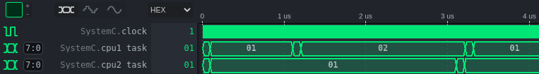
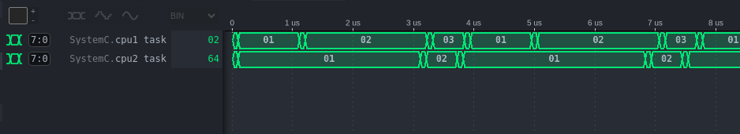
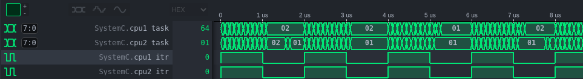

# Compte rendu TP1

## 1. Contents

- [1. Contents](#1-contents)
- [2. Authors](#2-authors)
- [3. Partie A: producteur/consommateur](#3-partie-a-producteurconsommateur)
- [4. TP 2](#4-tp-2)
  - [4.1. Compréhension du code fourni](#41-compréhension-du-code-fourni)
  - [4.2. Ajout des tâches 4 et 5](#42-ajout-des-tâches-4-et-5)
  - [4.3. Interuptions](#43-interuptions)

## 2. Authors

+ Dylan Robins
+ Quentin Werlé

## 3. Partie A: producteur/consommateur

On commence par compiler le programme fourni:

```
$ make
g++ -std=c++17 -O3 -Wall -I. -I.. -I/opt/systemc/include -c simple_fifo.cpp
g++ -std=c++17 -O3 -Wall -I. -I.. -I/opt/systemc/include -L. -L.. -L/opt/systemc/lib -o run.x simple_fifo.o -lsystemc -lm  2>&1 | c++filt

$ ./run.x

        SystemC 2.3.4_pub_rev_20191203-Accellera --- Mar 14 2022 14:37:05
        Copyright (c) 1996-2019 by all Contributors,
        ALL RIGHTS RESERVED


V<9>isit www.<0>s<9>ystemc.or<0>g<9> and see <0>w<9>hat Syste<0>m<9>C can do <0>f<9>or you to<0>day!
<0>%
```

On constate que le programme affiche une chaîne de caractères en indiquant à intervalles régulier un nombre (0 ou 9).

On observe maintenant le contenu du fichier cpp fourni afin de comprendre les différents objets utilisés. Commençons par étudier le point d'entrée du programme, la fonction `main`:

```c++
int sc_main (int argc , char *argv[]) {
  top top1("Top1");
  sc_start();
  return 0;
}
```

On constate qu'on instancie un objet de classe `top`, puis nous démarrons la simulation. L'objet `top` hérite de la classe `sc_module`, qui est décrite comme la *"Base class for all structural entities"*, c'est à dire qu'elle modélise le comportement de base d'une entité structurelle comme nous avons manipulé en VHDL.

Le constructeur de l'objet `top` instantie et connecte ensemble trois objets: une instance de `fifo`, une instance de `producer` et une instance de `consumer`. Les classes `producer` et `consumer` sont elles aussi des modules SystemC, mais contrairement à `top` elles comportent des variables publiques de type `sc_port`, qui comme leur nom l'indique modélisent des ports d'interconnexion entre les entités comme nous l'avons vu en VHDL. La classe `sc_port` est un template C++ prenant en paramètre une classe héritant de `sc_interface` qui permet de définir les opérations que nous pouvons effectuer sur port. Les constructeurs de ces deux classes font appel à la macro `SC_THREAD(main);` , permettant de simuler ces modules en parallèle dans des threads concurrents, et les deux classes comportent également une fonction `void main()` définissant le comportement du modèle (ce qui correspond à un "process" en VHDL).

La classe `fifo` est plus intéressante. Cette classe modélise un registre FIFO pouvant contenir jusqu'à 10 éléments de type `char` (= `uint8_t`). Contrairement aux autres classes vues jusqu'à présent, la `fifo` n'hérite pas de la classe `sc_module` mais de `sc_channel`, `write_if` et `read_if`. En effet, au lieu de modéliser une entité elle modélise un canal de communication entre deux entités, et doit à ce titre hériter d'une interface de lecture, d'une interface d'écriture. Puisqu'elle modélise simplement un moyen de communication et non pas une entité indépendante, cette classe ne crée pas de thread dédié pour son exécution et ne définit pas de `main()`. Son état est complètement piloté depuis les méthodes `read` et `write`, appelées dans par les instances de `producer` et de `consumer` et manipulant les variables membres de la classe. Parmi ces variables on trouve deux instances de `sc_event`, permettant d'établir une communication inter-module suivant une méthode "event-driven" et utilisés ici afin d'éviter les dépassements mémoire.

On modifie maintenant le programme en rajoutant un appel à `wait(20, SC_NS)` dans le fil principal du consommateur. On modifie également le format d'affichage afin de pouvoir suivre plus facilement le comportement du programme. On obtient donc l'affichage suivant:

```
$ ./run.x

        SystemC 2.3.4_pub_rev_20191203-Accellera --- Mar 14 2022 14:37:05
        Copyright (c) 1996-2019 by all Contributors,
        ALL RIGHTS RESERVED


0 s: 'V' <9>
20 ns: 'i' <9>
40 ns: 's' <9>
60 ns: 'i' <9>
80 ns: 't' <9>
100 ns: ' ' <9>
120 ns: 'w' <9>
140 ns: 'w' <9>
160 ns: 'w' <9>
180 ns: '.' <9>
200 ns: 's' <9>
220 ns: 'y' <9>
240 ns: 's' <9>
260 ns: 't' <9>
280 ns: 'e' <9>
300 ns: 'm' <9>
320 ns: 'c' <9>
340 ns: '.' <9>
360 ns: 'o' <9>
380 ns: 'r' <9>
400 ns: 'g' <9>
420 ns: ' ' <9>
440 ns: 'a' <9>
460 ns: 'n' <9>
480 ns: 'd' <9>
500 ns: ' ' <9>
520 ns: 's' <9>
540 ns: 'e' <9>
560 ns: 'e' <9>
580 ns: ' ' <9>
600 ns: 'w' <9>
620 ns: 'h' <9>
640 ns: 'a' <9>
660 ns: 't' <9>
680 ns: ' ' <9>
700 ns: 'S' <9>
720 ns: 'y' <9>
740 ns: 's' <9>
760 ns: 't' <9>
780 ns: 'e' <9>
800 ns: 'm' <9>
820 ns: 'C' <9>
840 ns: ' ' <9>
860 ns: 'c' <9>
880 ns: 'a' <9>
900 ns: 'n' <9>
920 ns: ' ' <9>
940 ns: 'd' <9>
960 ns: 'o' <9>
980 ns: ' ' <9>
1 us: 'f' <9>
1020 ns: 'o' <9>
1040 ns: 'r' <9>
1060 ns: ' ' <9>
1080 ns: 'y' <9>
1100 ns: 'o' <9>
1120 ns: 'u'
1140 ns: ' '
1160 ns: 't'
1180 ns: 'o'
1200 ns: 'd'
1220 ns: 'a'
1240 ns: 'y'
1260 ns: '!'
1280 ns: '
' <0>
1300 ns: %
```

En sachant que le token `<0>` est affiché par le consommateur lorsque la fifo est vide immédiatement après une lecture, et qu'à l'inverse le token `<9>` est affiché lorsque la fifo est pleine, on voit bien que la lecture d'un caractère provoque *immédiatement* l'insertion de l'élément suivant dans la file par le producteur. Le temps d'exécution du système est ici limité par le consommateur: le producteur remplit la fifo plus vite que le consommateur le vide, et doit par conséquent attendre une fois la fifo pleine.

Si on rajoute en plus une temporisation `wait(40, SC_NS)` dans le producteur, le goulot de bouteille est désormais au niveau du producteur: on obtient alors l'affichage suivant:

```
$ ./run.x

        SystemC 2.3.4_pub_rev_20191203-Accellera --- Mar 14 2022 14:37:05
        Copyright (c) 1996-2019 by all Contributors,
        ALL RIGHTS RESERVED


0 s: 'V' <0>
20 ns: 'i' <0>
60 ns: 's' <0>
100 ns: 'i' <0>
140 ns: 't' <0>
180 ns: ' ' <0>
220 ns: 'w' <0>
260 ns: 'w' <0>
300 ns: 'w' <0>
340 ns: '.' <0>
380 ns: 's' <0>
420 ns: 'y' <0>
460 ns: 's' <0>
500 ns: 't' <0>
540 ns: 'e' <0>
580 ns: 'm' <0>
620 ns: 'c' <0>
660 ns: '.' <0>
700 ns: 'o' <0>
740 ns: 'r' <0>
780 ns: 'g' <0>
820 ns: ' ' <0>
860 ns: 'a' <0>
900 ns: 'n' <0>
940 ns: 'd' <0>
980 ns: ' ' <0>
1020 ns: 's' <0>
1060 ns: 'e' <0>
1100 ns: 'e' <0>
1140 ns: ' ' <0>
1180 ns: 'w' <0>
1220 ns: 'h' <0>
1260 ns: 'a' <0>
1300 ns: 't' <0>
1340 ns: ' ' <0>
1380 ns: 'S' <0>
1420 ns: 'y' <0>
1460 ns: 's' <0>
1500 ns: 't' <0>
1540 ns: 'e' <0>
1580 ns: 'm' <0>
1620 ns: 'C' <0>
1660 ns: ' ' <0>
1700 ns: 'c' <0>
1740 ns: 'a' <0>
1780 ns: 'n' <0>
1820 ns: ' ' <0>
1860 ns: 'd' <0>
1900 ns: 'o' <0>
1940 ns: ' ' <0>
1980 ns: 'f' <0>
2020 ns: 'o' <0>
2060 ns: 'r' <0>
2100 ns: ' ' <0>
2140 ns: 'y' <0>
2180 ns: 'o' <0>
2220 ns: 'u' <0>
2260 ns: ' ' <0>
2300 ns: 't' <0>
2340 ns: 'o' <0>
2380 ns: 'd' <0>
2420 ns: 'a' <0>
2460 ns: 'y' <0>
2500 ns: '!' <0>
2540 ns: '
' <0>
2580 ns: %
```

On voit ici que la fifo n'a jamais l'occasion de se remplir puisque le consommateur retire les éléments des la fifo immédiatement après qu'ils aient été insérés par le producteur.

## 4. TP 2

### 4.1. Compréhension du code fourni

On analyse maintenant un système plus complexe, constitué de deux processeurs gérés par un système d'exploitation léger implémenté en SystemC.
+ Processeur: élément matériel capable d'exécuter des opérations
+ Système d'exploitation (OS): mécanisme permettant de gérér l'exécution de plusieurs tâches au sein d'un processeur
+ Tâche: action ou suite d'instructions à réaliser
+ Noyeau (kernel): mécanisme reliant un système d'exploitation au matériel sur lequel il tourne

Regardons maintenant l'ordonnancement des tâches définies par défaut.

```
$ ./run.x

        SystemC 2.3.4_pub_rev_20191203-Accellera --- Mar 14 2022 14:37:05
        Copyright (c) 1996-2019 by all Contributors,
        ALL RIGHTS RESERVED

Info: (I703) tracing timescale unit set: 1 ns (trace.vcd)
cpu1 - proc1 1
cpu2 - proc3 3
cpu1 - proc2 2
cpu2 - proc3 3
cpu1 - proc1 1
cpu1 - proc2 2
cpu2 - proc3 3
cpu1 - proc1 1
cpu1 - proc2 2
...
```

On voit que les deux CPUs exécutent trois processus: le cpu1 gère les processus 1 et 2, tandis que le cpu2 gère le processus 3. Ces processus sont en interne des *tâches*, et sont donc lancées de façon périodique par le scheduler. Les tâches sont définies de la façon suivante:

```cpp
bool proc1(Task* task, void* p) {
    IntHandler* par = (IntHandler*)p;
    cout << task->m_name << " " << par->i << endl;
    CONSUME(par->i * 100);
    return true;
}
```

Ici, le paramètre p prend les valeurs 1, 2 et 3 pour les tâches 1, 2 et 3 respectivement. Le temps d'exécution des deux tâches s'exécutant sur le cpu 1 devrait donc être équivalent à celui du processus 3, exécuté à lui seul sur le cpu2. C'est bien ce qu'on voit sur le tracé des signaux ci-dessous:



Nous constatons en revanche que dans le cpu1, la tâche 2 n'est lancée que quand la tâche 1 s'est terminée: le système n'est donc pas préemptif.

La création d'une tâche se déroule de la façon suivante:
1. Dans la fonction main, nous instantions le top, et nous ajoutons aux différents CPUs les différents processus que nous souhaitons qu'ils exécutent
2. Chaque CPU soumet alors à son OS la nouvelle  avec la méthode `OS::RegisterTask`. Cette méthode ajoute simplement la nouvelle tâche à la fin du vecteur de tâches du système `m_tasks`.
3. Lorsque la tâche en question arrive au sommet du vecteur de tâches, elle est exécutée. 
4. Celle-ci s'exécute sur le CPU jusqu'à la fin ou jusqu'à l'apparition d'une interruption. L'interruption arrête la tâche en cours et met à jour le status de la tâche. Le fil d'éxecution est alors suspendu et pourra être relancé plus tard. 
   
La destruction quant à elle se déroule de la manière suivante:
1. Dans `OS::TaskExit`, le status est mis à jour
2. Une attente d'un front est réalisée afin de pouvoir visualiser son comportement sur la simulation
3. La tâche est supprimée du vecteur de tâches `m_tasks`.


### 4.2. Ajout des tâches 4 et 5

On se propose de venir créer une nouvelle tâche proc4 qui recevra 3 arguments: deux entiers et une chaîne de caractère. Cette dernière affichera en continu la somme des deux paramètres ainsi que la chaîne de caractère. Son code est le suivant:

```cpp
bool proc4(Task* task, void* p) {
    // To be completed
    Proc4ArgumentHandler * par = (Proc4ArgumentHandler *) p;
    std::cout << par->_a << " + " << par->_b << " = " << par->_a + par->_b 
                << ", " << par->_s << std::endl;
    CONSUME(50);
    
    return true;
}
```

Nous avons choisi d'intégrer un temps d'exécution afin que son exécution soit visible dans l'outil de simulation. 

AJOUTER CHRONOGRAMMES

On se propose de modifier le processus 1 afin qu'il crée et lance à la volée une 5e tâche. On définit donc une nouvelle fonction `proc5` définissant le comportement de la nouvelle tâche, et on soumet la tâche à l'OS dans le corps de la fonction `proc1`:

```cpp
bool proc1(Task* task, void* p) {
    IntHandler* par = (IntHandler*)p;
    Proc4ArgumentHandler *par5 = new Proc4ArgumentHandler(10, 10, "Foo Bar!");

    cout << task->m_name << " " << par->i << endl;

    CONSUME(par->i * 100);

    task->m_os->RegisterTask(proc5, (void *)par5, "cpu1 - proc5", 4, false);
    
    return true;
}

bool proc5(Task* task, void* p) {
    Proc4ArgumentHandler * par = (Proc4ArgumentHandler *) p;
    std::cout << par->_a << " + " << par->_b << " = " << par->_a + par->_b 
                << ", " << par->_s << std::endl;
    CONSUME(50);

    delete par;

    // Do not restart the process
    return false;
}
```

On observe alors l'affichage et le chronogramme suivant:

```
cpu1 - proc1 1
cpu2 - proc3 3
cpu1 - proc2 2
2 + 2 = 4, Hello World!
10 + 10 = 20, Foo Bar!
cpu2 - proc3 3
cpu1 - proc1 1
cpu1 - proc2 2
2 + 2 = 4, Hello World!
10 + 10 = 20, Foo Bar!
cpu2 - proc3 3
cpu1 - proc1 1
cpu1 - proc2 2
```



### 4.3. Interuptions

Le port d'interruption des CPUs nous permettent de provoquer l'arrêt immédiat de la tâche en cours au profit d'une nouvelle tâche de priorité plus haute. Cela nous permet, dans un environnement temps réel, de garantir des temps de traitement plus faibles.

